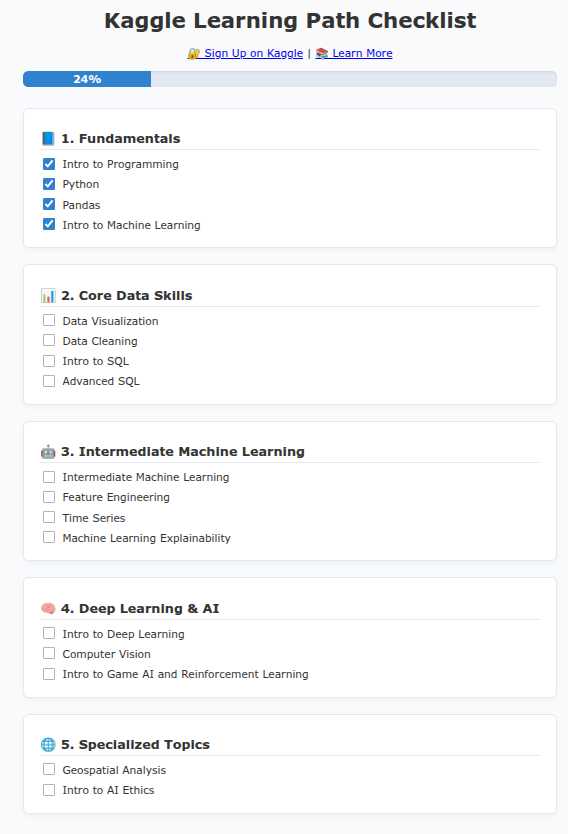

# 🧠 Kaggle Learning Path Checklist


A simple and elegant web-based checklist to track your progress through Kaggle's learning courses. This tool helps you visualize your journey, stay motivated, and complete all the essential Data Science and Machine Learning tracks offered by Kaggle.

---

## 🚀 Features

- ✅ Clean, responsive UI
- 🌙 Light & Dark mode toggle
- 📊 Dynamic progress bar
- 💾 Progress auto-saved using local storage
- 🔗 Direct links to Kaggle Sign-Up and Course Page

---

## 📸 Preview



---

## 🛠️ Tech Stack

- **HTML5** – Markup structure
- **CSS3** – Custom themes with dark mode
- **JavaScript** – State handling & local storage

---

## 🔗 Useful Links

- [📚 Kaggle Courses Overview](https://www.kaggle.com/learn)
- [🔐 Sign Up on Kaggle](https://www.kaggle.com/account/login?phase=startRegisterTab)

---

## 📂 File Structure

```plaintext
.
├── index.html       # Main UI structure
├── style.css        # Custom styles and dark mode
├── script.js        # Progress tracking logic
├── assets/
│   └── screenshot.png   # Project preview image
└── LICENSE          # MIT License
